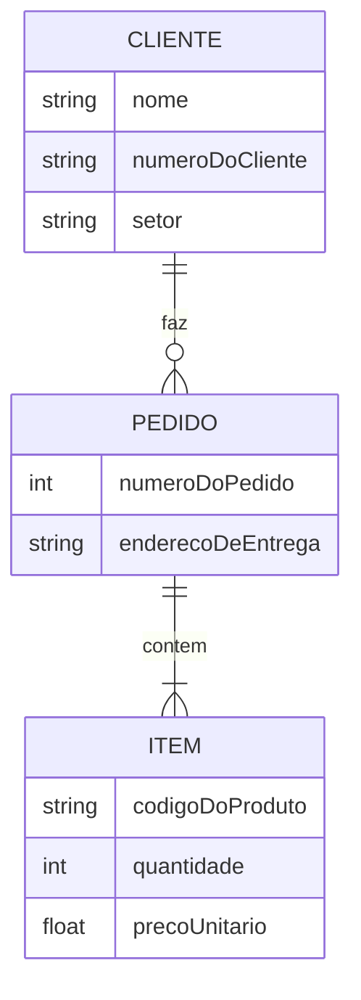

# fatec_senairs_topicos_avancados_prova_g1

```mermaid
erDiagram
    CLIENTE ||--o{ PEDIDO : faz
    CLIENTE {
        string nome
        string numeroDoCliente
        string setor
    }
    PEDIDO ||--|{ ITEM : contem
    PEDIDO {
        int numeroDoPedido
        string enderecoDeEntrega
    }
    ITEM {
        string codigoDoProduto
        int quantidade
        float precoUnitario
    }
```
