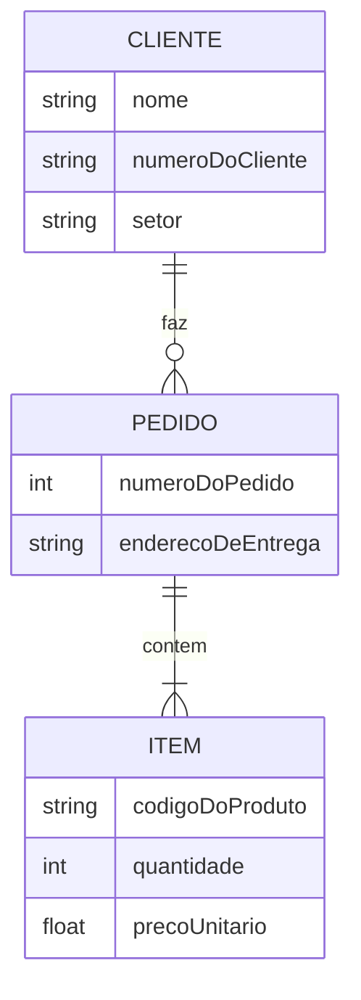
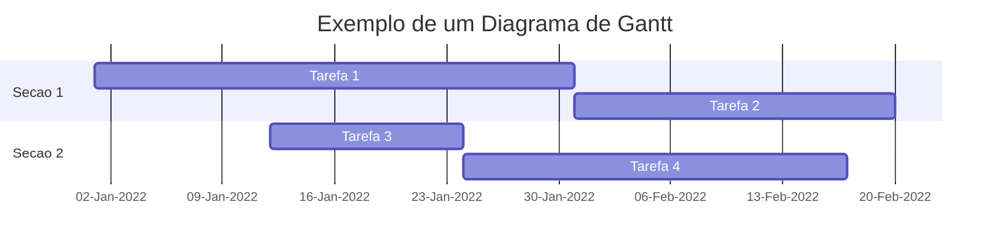

# fatec_senairs_topicos_avancados_prova_g1

```mermaid
erDiagram
    CLIENTE ||--o{ PEDIDO : faz
    CLIENTE {
        string nome
        string numeroDoCliente
        string setor
    }
    PEDIDO ||--|{ ITEM : contem
    PEDIDO {
        int numeroDoPedido
        string enderecoDeEntrega
    }
    ITEM {
        string codigoDoProduto
        int quantidade
        float precoUnitario
    }
```

## https://www.alura.com.br/artigos/Diagramas-markdown-com-JS-hash-e-criptografia-emais-alura-stars

```mermaid
gantt
    title Exemplo de um Diagrama de Gantt
    %% comentário
    dateFormat  DD-MM-YYYY
    axisFormat  %d-%b-%Y
    section Secao 1
    Tarefa 1        :a1, 01-01-2022, 30d
    Tarefa 2        :after a1  , 20d
    section Secao 2
    Tarefa 3        :12-01-2022  , 12d
    Tarefa 4        :24d
```
